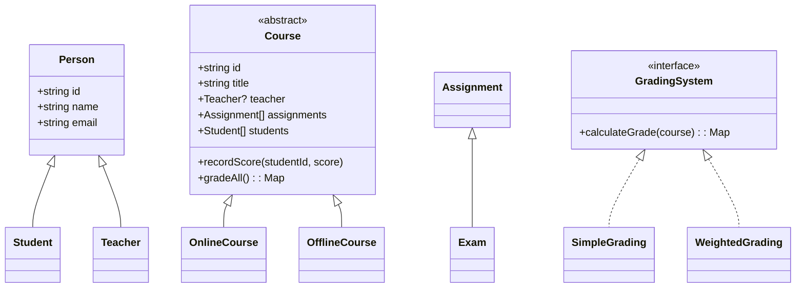

# Online Learning Platform — React + TypeScript (OOP)

This project is an educational, frontend-only prototype that implements:
- **Classes**: Course, Student, Teacher, Assignment, Exam
- **Inheritance**: OnlineCourse and OfflineCourse extend Course
- **Interfaces**: GradingSystem interface with implementations (SimpleGrading, WeightedGrading)
- Clean, friendly UI and well-structured TypeScript code

## UML (Mermaid)

## Run locally
1. `npm install`
2. `npm run dev`
3. Open `http://localhost:5173`

## Notes
- This is frontend-only. For a real platform add backend, auth, DB, and file storage.
- Code organized under `src/` into `models`, `grading`, and `components`.
